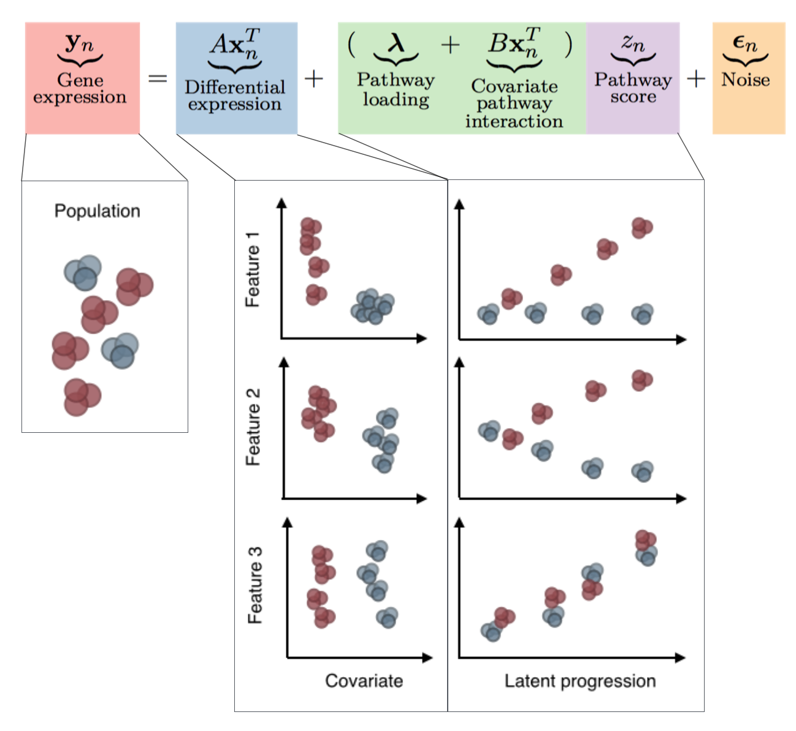

```{r load-packages, include=FALSE}
knitr::opts_chunk$set(fig.width = 5, fig.height = 3)

suppressPackageStartupMessages({
  library(dplyr)
  library(dplyr)
  library(ggplot2)
  library(tidyr)
  library(forcats)
  library(phenopath)
})
```

# Overview of PhenoPath

## The PhenoPath model

PhenoPath models gene expression expression $y$ in terms of a latent pathway score (pseudotime) $z$. Uniquely, the evolution of genes along the trajectory isn't common to each gene but can be perturbed by an additional sample-specific covariate $\beta$. For example, this could be the mutational status of each sample or a drug that each sample was exposed to.



This software infers both the latent pathway scores $z_n$ and interaction coefficients $\beta_{pg}$ for samples $n = 1, \ldots, N$, covariates $p = 1, \ldots, P$ and genes $G = 1, \ldots, G$.

## Mean-field variational inference

Inference is performed using co-ordinate ascent mean field variational inference. This attempts to find a set of approximating distributions $q(\mathbf{\theta}) = \prod_i q_i(\theta_i)$ for each variable $i$ by minimising the KL divergence between the KL divergence between the variational distribution and the true posterior. For a good overview of variational inference see @blei2016variational.

# Example on simulated data

## Simulating data

We can simulate data according to the PhenoPath model via a call to `simulate_phenopath()`:

```{r simulate-data}
set.seed(123L)
sim <- simulate_phenopath()
```

This returns a list with four entries:

```{r sim-structure}
print(str(sim))
```

* `parameters` is a data frame with the simulated parameters, with a column for each of the parameters $\alpha$, $\beta$ and $\lambda$, and a row for each gene. There is an additional column specifying from which regime that gene has been simulated (see `?simulate_phenopath` for details).
* `y` is the $N \times G$ matrix of gene expression
* `x` is the $N$-length vector of covariates
* `z` is the true latent pseudotimes

By default this simulates the model for $N= 100$ cells and $G=40$ genes.

For 8 representative genes we can visualise what the expression looks like over pseudotime:

```{r some-genes, fig.width = 7}
genes_to_extract <- c(1,3,11,13,21,23,31,33)
expression_df <- as.data.frame(sim$y[,genes_to_extract])
names(expression_df) <- paste0("gene_", genes_to_extract)

df_gex <- tibble(expression_df) %>% 
  mutate(x = factor(sim[['x']]), z = sim[['z']]) %>% 
  gather(gene, expression, -x, -z)

ggplot(df_gex, aes(x = z, y = expression, color = x)) +
  geom_point() +
  facet_wrap(~ gene, nrow = 2) +
  scale_color_brewer(palette = "Set1")
```

We see for the first two genes there is differential expression only, genes 3 and 4 show a pseudotime dependence, genes 5 and 6 show pseudotime-covariate interactions (but marginally no differential expression), while genes 7 and 8 show differential expression, pseudotime dependence and pseudotime-covariate interactions.

We can further plot this in PCA space, coloured by both covariate and pseudotime to get an idea of how these look in the reduced dimension:

```{r pcaing, fig.show = 'hold'}
pca_df <- tibble(as.data.frame(prcomp(sim$y)$x[,1:2])) %>% 
  mutate(x = factor(sim[['x']]), z = sim[['z']])

ggplot(pca_df, aes(x = PC1, y = PC2, color = x)) +
  geom_point() + scale_colour_brewer(palette = "Set1")

ggplot(pca_df, aes(x = PC1, y = PC2, color = z)) +
  geom_point()
```


## Fit PhenoPath model

PhenoPath fits models with a call to the `phenopath` function, which requires at least an expression matrix `y` and a covariate vector `x`. The expression data should represent something comparable to logged counts, such as $log_2(\text{TPM}+1)$. Note that buy default PhenoPath centre-scales the input expression.

For use with `SummarizedExperiment`s see the [section on input formats](#inputdata). For this example we choose an ELBO tolerance of `1e-6` and ELBO calculations thinned by `40`. A discussion of how to control variational inference can be found [below](#varcontrol).

```{r see-results, cache=TRUE}
fit <- phenopath(sim$y, sim$x, elbo_tol = 1e-6, thin = 40)
print(fit)
```

The `phenopath` function will print progress on iterations, ELBO, and % change in ELBO that may be turned off by setting `verbose = FALSE` in the call.

Once the model has been fit it is important to check convergence with a call to `plot_elbo(fit)` to ensure the ELBO is approximately flat:

```{r plot-elbo}
plot_elbo(fit)
```

## Examining results


The posterior mean estimates of the pseudotimes $z$ sit in `fit$m_z` that can be extracted using the `trajectory` function. We can visualise these compared to both the true pseudotimes and the first principal component of the data:

```{r plot-results, fig.show = 'hold', fig.width = 2.5, fig.height = 2.5}
qplot(sim$z, trajectory(fit)) +
  xlab("True z") + ylab("Phenopath z")
qplot(sim$z, pca_df$PC1) +
  xlab("True z") + ylab("PC1")
```

We see that this has high correlation with the true pseudotimes:

```{r print-correlation}
cor(sim$z, trajectory(fit))
```

Next, we're interested in the interactions between the latent space and the covariates. There are three functions to help us here:

* `interaction_effects` retrieves the posterior interaction effect sizes
* `interaction_sds` retrieves the posterior interaction standard deviations
* `significant_interactions` applies a Bayesian significant test to the interaction parameters

Note that if $P=1$ (ie there is only one covariate) each of these will return a vector, while if $P>1$ then a matrix is returned. 

Alternatively, one can call the `interactions` function that returns a data frame with the following entries:

* `feature` The feature (usually gene)
* `covariate` The covariate, specified from the order originally supplied to the call to `phenopath`
* `interaction_effect_size` The effect size of the interaction ($\beta$ from the statistical model)
* `significant` Boolean for whether the interaction effect is significantly different from 0
* `chi` The precision of the ARD prior on $\beta$
* `pathway_loading` The pathway loading $\lambda$, showing the overall effect for each gene marginalised over the covariate

In our simulated data above, the first 20 genes were simulated with no interaction effect while the latter 20 were simulated with interaction effects. We can pull out the interaction effect sizes, standard deviations, and significance test results into a data frame and plot:

```{r beta-df, fig.width = 6, fig.height = 3}
gene_names <- paste0("gene", seq_len(ncol(fit$m_beta)))
df_beta <- data_frame(beta = interaction_effects(fit),
                      beta_sd = interaction_sds(fit),
                      is_sig = significant_interactions(fit),
                      gene = gene_names)

df_beta$gene <- fct_relevel(df_beta$gene, gene_names)

ggplot(df_beta, aes(x = gene, y = beta, color = is_sig)) + 
  geom_point() +
  geom_errorbar(aes(ymin = beta - 2 * beta_sd, ymax = beta + 2 * beta_sd)) +
  theme(axis.text.x = element_text(angle = 90, hjust = 1),
        axis.title.x = element_blank()) +
  ylab(expression(beta)) +
  scale_color_brewer(palette = "Set2", name = "Significant")
```

A typical analysis might follow by graphing the largest effect size; we can do this as follows:

```{r graph-largest-effect-size}
which_largest <- which.max(df_beta$beta)

df_large <- data_frame(
  y = sim[['y']][, which_largest],
  x = factor(sim[['x']]),
  z = sim[['z']]
)

ggplot(df_large, aes(x = z, y = y, color = x)) +
  geom_point() +
  scale_color_brewer(palette = "Set1") +
  stat_smooth()
```

# Advanced

## Using an `SummarizedExperiment` as input

Alternatively you might have expression values in an `SummarizedExperiment`. For single-cell data it is highly recommended to use the [SummarizedExperiment](https://bioconductor.org/packages/release/bioc/html/summarizedexperiment.html)  in which case data is stored in a class derived from `SummarizedExperiment`.

We'll first construct an example `SummarizedExperiment` using our previous simulation data:

```{r construct-sceset, warning = FALSE}
suppressPackageStartupMessages(library(SummarizedExperiment))
exprs_mat <- t(sim$y)
pdata <- data.frame(x = sim$x)
sce <- SummarizedExperiment(assays = list(exprs = exprs_mat), 
                            colData = pdata)
sce
```

Note that PhenoPath will use by default is in the `exprs` assay of a `SummarizedExperiment` (ie `assay(sce, "exprs")`) as gene expression values, which can be changed using the `sce_assay` string in the column to `phenopath`. 

We can then pass the $x$ covariates to PhenoPath in three ways:

1. As a vector or matrix as before
2. As a character that names a column of `colData(sce)` to use
3. A formula to build a model matrix from `colData(sce)`

For our example, these three look like

```{r example-using-expressionset, eval = FALSE}
fit <- phenopath(sce, sim$x) # 1
fit <- phenopath(sce, "x") # 2
fit <- phenopath(sce, ~ x) # 3
```

Note that if the column of the SCESet is a factor it is coerced into a one-hot encoding. The intercept term is then removed as this is taken care of by the $\lambda$ coefficient automatically, and the columns centre-scaled.

## Initialisation of latent space

The posterior distribution is naturally multi-modal and the use of variational inference means we essentially dive straight into the nearest local maximum. Therefore, correct initialisation of the latent space is important. This is controlled through the `z_init` argument.

PhenoPath allows for three different initialisations:

1. An integer specifying a principal component of the data to initialise to
2. A vector specifying the initial values
3. Random initialisation from standard normal distribution

For our example these three look like

```{r initialisation-examples, eval = FALSE}
fit <- phenopath(sim$y, sim$x, z_init = 1) # 1, initialise to first principal component
fit <- phenopath(sim$y, sim$x, z_init = sim$z) # 2, initialise to true values
fit <- phenopath(sim$y, sim$x, z_init = "random") # 3, random initialisation
```

## Controlling variational inference {#varcontrol}

There are several parameters that tune the coordinate ascent variational inference (CAVI):

1. `maxiter` maximum number of iterations to run CAVI for
2. `elbo_tol` the _percentage_ change in the ELBO below which the 
model is considered converged
3. `thin` Computing the ELBO is expensive, so only compute the ELBO every
`thin` iterations

For example:

```{r cavi-tuning, eval = FALSE}
fit <- phenopath(sim$y, sim$x,
                 maxiter = 1000, # 1000 iterations max
                 elbo_tol = 1e-2, # consider model converged when change in ELBO < 0.02%
                 thin = 20 # calculate ELBO every 20 iterations
                 )
```

# Technical

```{r sessioninfo}
sessionInfo()
```

# References